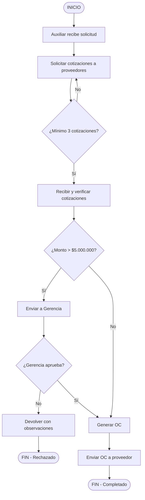

# NetVault — Arquitectura de Sistema de Entrenamiento IA

**Versión:** 1.0  
**Fecha:** 2026-06-01  
**Estado:** Planificado  
**Proyecto:** NetVault Desktop + ZYMO Training Platform

---

## 1. Resumen Ejecutivo

### 1.1 Qué es NetVault

NetVault es una aplicación de escritorio desarrollada con Electron que permite:

- **Gestionar archivos locales y de red** con interfaz de doble panel
- **Leer PDFs y documentos Word** y convertirlos a Markdown
- **Analizar procedimientos empresariales** usando Claude Sonnet 4
- **Generar flujogramas** en formato Mermaid (SVG, PNG, MMD)
- **Construir grafos de conocimiento** locales con nodos y relaciones
- **Publicar análisis** en un servidor compartido (foro de equipo)
- **Alimentar el entrenamiento** del agente ZYMO en la intranet

### 1.2 Objetivo Principal

Crear una herramienta que permita al gerente analizar procedimientos de la empresa, generar conocimiento estructurado, y alimentar el sistema de IA de ZYMO para su entrenamiento continuo.

### 1.3 Stack Tecnológico

| Componente | Tecnología |
|------------|------------|
| **Desktop Shell** | Electron 29+ |
| **Frontend** | React 18 + TypeScript 5 + Tailwind CSS |
| **Backend Local** | Node.js (reemplaza Python de NetVault original) |
| **IA** | Claude Sonnet 4 via API Anthropic |
| **Base de Datos Local** | SQLite |
| **Visualización de Grafos** | D3.js / React Force Graph |
| **Conversión Documentos** | PDF.js, Mammoth.js |
| **Flujogramas** | Mermaid.js |
| **Servidor** | FastAPI (Python) + PostgreSQL |
| **Indexación IA** | LightRAG (existente en zymointranet.com) |
| **Autenticación** | JWT con perfiles de usuario |

---

## 2. Arquitectura del Sistema

### 2.1 Diagrama General

```
┌─────────────────────────────────────────────────────────────────────────────┐
│                         NETVAULT DESKTOP APP                                │
│                          (Electron + React)                                 │
├─────────────────────────────────────────────────────────────────────────────┤
│                                                                             │
│  ┌─────────────────────────────────────────────────────────────────────┐   │
│  │                         CAPA DE PRESENTACIÓN                         │   │
│  │  ┌──────────┐  ┌──────────┐  ┌──────────┐  ┌──────────────────┐   │   │
│  │  │ FilePanel│  │ PDF Viewer│  │ AI Chat  │  │  Graph Viewer    │   │   │
│  │  │ (x2)     │  │           │  │          │  │  (D3.js)         │   │   │
│  │  └──────────┘  └──────────┘  └──────────┘  └──────────────────┘   │   │
│  └─────────────────────────────────────────────────────────────────────┘   │
│                                                                             │
│  ┌─────────────────────────────────────────────────────────────────────┐   │
│  │                         CAPA DE NEGOCIO                               │   │
│  │  ┌────────────┐  ┌────────────┐  ┌────────────┐  ┌────────────┐   │   │
│  │  │ Document   │  │ Analyzer   │  │ Graph      │  │ Exporter   │   │   │
│  │  │ Service    │  │ Service    │  │ Service    │  │ Service    │   │   │
│  │  │ (PDF/Word) │  │ (Claude)   │  │ (SQLite)  │  │ (.ZIP)     │   │   │
│  │  └────────────┘  └────────────┘  └────────────┘  └────────────┘   │   │
│  └─────────────────────────────────────────────────────────────────────┘   │
│                                                                             │
│  ┌─────────────────────────────────────────────────────────────────────┐   │
│  │                         CAPA DE DATOS                                │   │
│  │  ┌─────────────────────────────────────────────────────────────────┐ │   │
│  │  │  SQLite Local — Grafo de conocimiento por proyecto              │ │   │
│  │  │  Perfil de usuario — Configuración y API keys                   │ │   │
│  │  └─────────────────────────────────────────────────────────────────┘ │   │
│  └─────────────────────────────────────────────────────────────────────┘   │
│                                                                             │
└─────────────────────────────────────────────────────────────────────────────┘
                                    │
                                    │ .ZIP exportado
                                    ▼
┌─────────────────────────────────────────────────────────────────────────────┐
│                         SERVIDOR COMPARTIDO                                 │
│                      (zymointranet.com / servidor-local)                     │
├─────────────────────────────────────────────────────────────────────────────┤
│                                                                             │
│  ┌─────────────────────────────────────────────────────────────────────┐   │
│  │                         FORO DE EQUIPO                                │   │
│  │  ┌────────────┐  ┌────────────┐  ┌────────────┐  ┌────────────┐   │   │
│  │  │ Publicar   │  │ Ver        │  │ Comentar  │  │ Descargar  │   │   │
│  │  │ Análisis   │  │ Publicaciones│ │ Publicación│  │ Paquetes   │   │   │
│  │  └────────────┘  └────────────┘  └────────────┘  └────────────┘   │   │
│  └─────────────────────────────────────────────────────────────────────┘   │
│                                                                             │
│  ┌─────────────────────────────────────────────────────────────────────┐   │
│  │                    ZYMO TRAINING PIPELINE                             │   │
│  │  ┌────────────┐  ┌────────────┐  ┌────────────┐  ┌────────────┐   │   │
│  │  │ Receptor   │  │ Parser     │  │ Embeddings │  │ LightRAG   │   │   │
│  │  │ .ZIP       │──▶│ Grafos    │──▶│ (Claude)   │──▶│ Indexación│   │   │
│  │  └────────────┘  └────────────┘  └────────────┘  └────────────┘   │   │
│  └─────────────────────────────────────────────────────────────────────┘   │
│                                                                             │
│  ┌─────────────────────────────────────────────────────────────────────┐   │
│  │                    ZYMO AGENT (Actualizado)                          │   │
│  │  • Base de conocimiento actualizada con nuevos procedimientos          │   │
│  │  • Grafos de relaciones entre entidades empresariales               │   │
│  │  • Contexto enriquecido para respuestas más precisas                  │   │
│  └─────────────────────────────────────────────────────────────────────┘   │
│                                                                             │
└─────────────────────────────────────────────────────────────────────────────┘
```

### 2.2 Flujo de Datos

```
                    GERENTE (Local)                    SERVIDOR                    ZYMO
                         │                               │                          │
    ┌───────────────────┼───────────────────┐            │                          │
    │                   │                   │            │                          │
    ▼                   ▼                   ▼            │                          │
┌─────────┐      ┌───────────┐       ┌───────────┐     │                          │
│ PDF/Word│      │ Selección │       │ Análisis  │     │                          │
│Leídos   │─────▶│Proyecto   │─────▶│Claude IA  │     │                          │
└─────────┘      └───────────┘       └─────┬─────┘     │                          │
                                          │             │                          │
                                          ▼             │                          │
                                   ┌───────────┐       │                          │
                                   │ Flujograma│       │                          │
                                   │(Mermaid)  │       │                          │
                                   └─────┬─────┘       │                          │
                                         │             │                          │
                                         ▼             │                          │
                                   ┌───────────┐       │                          │
                                   │ Grafo JSON│       │                          │
                                   │(Entidades │       │                          │
                                   │+Relaciones)       │                          │
                                   └─────┬─────┘       │                          │
                                         │             │                          │
                                         ▼             │                          │
                                  ┌───────────┐       │                          │
                                  │ .ZIP      │       │                          │
                                  │Exportado  │──────▶│                          │
                                  └───────────┘       │                          │
                                                      ▼                          │
                                              ┌───────────────┐                  │
                                              │ ForodeEquipo │                  │
                                              │ (Publicación)│                  │
                                              └───────┬───────┘                  │
                                                      │                          │
                                                      ▼ Revisión Manual          │
                                              ┌───────────────┐                  │
                                              │ Andrés        │──────────────────│
                                              │ (Desarrollador)                  │
                                              └───────┬───────┘                  │
                                                      │                          │
                                                      ▼ Aprobado                  │
                                              ┌───────────────┐                  │
                                              │ ZYMO Pipeline │──────────────────▶│
                                              │ Training      │                  │
                                              └───────────────┘                  │
```

---

## 3. Estructura del Proyecto

### 3.1 Estructura de Carpetas — App Desktop

```
netvault/
├── electron/
│   ├── main.ts                     # Proceso principal Electron
│   ├── preload.ts                  # Script de preload (IPC seguro)
│   └── ipc/
│       ├── fileHandlers.ts         # Sistema de archivos
│       ├── dialogHandlers.ts       # Diálogos nativos
│       └── windowHandlers.ts       # Control de ventanas
│
├── src/
│   ├── main.tsx                   # Entry point React
│   ├── App.tsx                    # Componente principal
│   │
│   ├── components/
│   │   ├── layout/
│   │   │   ├── Toolbar.tsx
│   │   │   ├── Sidebar.tsx
│   │   │   └── StatusBar.tsx
│   │   │
│   │   ├── file-panel/
│   │   │   ├── FilePanel.tsx
│   │   │   ├── FileList.tsx
│   │   │   └── FileItem.tsx
│   │   │
│   │   ├── document-viewer/
│   │   │   ├── PDFViewer.tsx      # Visor de PDFs
│   │   │   ├── WordViewer.tsx     # Visor de Word
│   │   │   └── MarkdownEditor.tsx  # Editor de Markdown
│   │   │
│   │   ├── ai/
│   │   │   ├── AIChat.tsx         # Chat con Claude
│   │   │   ├── Analyzer.tsx        # Panel de análisis
│   │   │   └── FlowchartGen.tsx    # Generador de flujogramas
│   │   │
│   │   ├── graph/
│   │   │   ├── GraphViewer.tsx     # Visualización D3.js
│   │   │   ├── NodeEditor.tsx      # Editor de nodos
│   │   │   └── EdgeEditor.tsx      # Editor de relaciones
│   │   │
│   │   ├── forum/
│   │   │   ├── PublicationList.tsx  # Lista de publicaciones
│   │   │   ├── PublicationCard.tsx   # Tarjeta de publicación
│   │   │   ├── CreatePublication.tsx # Crear publicación
│   │   │   └── PublicationDetail.tsx # Detalle completo
│   │   │
│   │   └── common/
│   │       ├── Button.tsx
│   │       ├── Modal.tsx
│   │       ├── ContextMenu.tsx
│   │       └── Toast.tsx
│   │
│   ├── hooks/
│   │   ├── useFileSystem.ts
│   │   ├── useClaude.ts           # Cliente Claude API
│   │   ├── useGraph.ts            # Grafo local SQLite
│   │   ├── useForum.ts            # Conexión al servidor
│   │   └── useProfile.ts          # Perfil de usuario
│   │
│   ├── services/
│   │   ├── fileService.ts         # Operaciones de archivo
│   │   ├── documentService.ts     # PDF/Word → Markdown
│   │   ├── claudeService.ts       # Llamadas a Claude
│   │   ├── graphService.ts        # SQLite grafo local
│   │   ├── flowchartService.ts     # Generador Mermaid
│   │   ├── exportService.ts       # Generador .ZIP
│   │   └── forumService.ts        # API del servidor
│   │
│   ├── stores/
│   │   ├── projectStore.ts        # Zustand: proyecto activo
│   │   ├── graphStore.ts          # Zustand: estado del grafo
│   │   └── uiStore.ts             # Zustand: estado de UI
│   │
│   ├── types/
│   │   ├── document.types.ts
│   │   ├── graph.types.ts
│   │   ├── flowchart.types.ts
│   │   ├── publication.types.ts
│   │   └── profile.types.ts
│   │
│   └── utils/
│       ├── formatters.ts
│       ├── validators.ts
│       └── constants.ts
│
├── server/                        # Backend del servidor
│   ├── index.ts                  # Entry point FastAPI
│   ├── routers/
│   │   ├── forum.py              # Endpoints del foro
│   │   └── zymo_training.py      # Pipeline de entrenamiento ZYMO
│   ├── services/
│   │   ├── publication_service.py
│   │   ├── zip_parser.py         # Parser de .ZIP recibidos
│   │   ├── graph_parser.py       # Extrae grafos del JSON
│   │   ├── embedding_service.py  # Genera embeddings con Claude
│   │   └── lightrag_indexer.py   # Indexa en LightRAG
│   └── models/
│       ├── publication.py        # Modelo SQLAlchemy
│       ├── user.py               # Modelo usuario
│       └── training_job.py        # Jobs de entrenamiento
│
├── package.json
├── electron-builder.yml
├── vite.config.ts
├── tailwind.config.js
├── tsconfig.json
└── .env.example
```

### 3.2 Estructura del Proyecto Local (Carpeta de Trabajo)

Cuando el usuario selecciona una carpeta de proyecto:

```
mi-proyecto-analisis/
│
├── .netvault/                     # Configuración local (gitignore)
│   ├── config.json                # { proyectoId, servidorUrl, apiKey }
│   ├── graph.db                   # SQLite — grafo local
│   └── cache/                    # Caché de documentos procesados
│
├── documentos/                    # Documentos originales
│   ├── proc_gestion_oc.pdf
│   └── manual_servicios.docx
│
├── contenido/                     # Markdowns convertidos
│   ├── proc_gestion_oc.md
│   └── manual_servicios.md
│
├── flujogramas/                  # Generados por IA
│   ├── proc_gestion_oc.mmd       # Mermaid
│   ├── proc_gestion_oc.svg
│   ├── proc_gestion_oc.png
│   ├── manual_servicios.mmd
│   ├── manual_servicios.svg
│   └── manual_servicios.png
│
└── grafo/                        # Exportaciones
    └── entidades.json
```

### 3.3 Estructura del Paquete .ZIP

```
analisis_[area]_[fecha]_[autor].zip
│
├── contenido/
│   ├── [archivo1].md             # Markdown con YAML frontmatter
│   ├── [archivo2].md
│   └── ...
│
├── flujogramas/
│   ├── [archivo1].mmd            # Mermaid
│   ├── [archivo1].svg
│   ├── [archivo1].png
│   └── ...
│
├── grafo/
│   └── entidades.json            # Nodos y relaciones
│
├── metadata/
│   ├── autor.json                # { nombre, email, fecha }
│   ├── proyecto.json             # { nombre, area, descripcion }
│   └── archivos.json             # Índice de archivos incluidos
│
└── manifest.json                 # Manifiesto general
```

---

## 4. Modelo de Datos

### 4.1 Base de Datos Local (SQLite)

**Archivo:** `.netvault/graph.db`

```sql
-- Nodos del grafo de conocimiento
CREATE TABLE nodes (
    id TEXT PRIMARY KEY,                    -- UUID
    tipo TEXT NOT NULL,                    -- 'proceso' | 'rol' | 'decision' | 'documento' | 'concepto'
    nombre TEXT NOT NULL,
    descripcion TEXT,
    propiedades JSON,                        -- { color, icono, etc }
    documento_origen TEXT,                  -- FK al documento donde se detectó
    creado_en TEXT DEFAULT CURRENT_TIMESTAMP,
    actualizado_en TEXT DEFAULT CURRENT_TIMESTAMP
);

-- Relaciones entre nodos
CREATE TABLE edges (
    id TEXT PRIMARY KEY,                    -- UUID
    source_id TEXT NOT NULL REFERENCES nodes(id),
    target_id TEXT NOT NULL REFERENCES nodes(id),
    tipo TEXT NOT NULL,                    -- 'secuencial' | 'condicional' | 'jerarquico' | 'referencia'
    label TEXT,                            -- Etiqueta de la relación
    propiedades JSON,                       -- { condicional, etc }
    creado_en TEXT DEFAULT CURRENT_TIMESTAMP
);

-- Documentos procesados
CREATE TABLE documents (
    id TEXT PRIMARY KEY,
    nombre TEXT NOT NULL,
    ruta_original TEXT NOT NULL,
    ruta_markdown TEXT NOT NULL,
    tipo TEXT NOT NULL,                    -- 'pdf' | 'docx' | 'md'
    hash TEXT NOT NULL,                    -- Para detectar cambios
    estado TEXT DEFAULT 'pendiente',        -- 'pendiente' | 'analizado' | 'publicado'
    anulado BOOLEAN DEFAULT FALSE,
    creado_en TEXT DEFAULT CURRENT_TIMESTAMP,
    actualizado_en TEXT DEFAULT CURRENT_TIMESTAMP
);

-- Análisis realizados por Claude
CREATE TABLE analyses (
    id TEXT PRIMARY KEY,
    documento_id TEXT REFERENCES documents(id),
    prompt TEXT NOT NULL,
    respuesta TEXT NOT NULL,
    tokens_usados INTEGER,
    costo_usd REAL,
    creado_en TEXT DEFAULT CURRENT_TIMESTAMP
);

-- Flujogramas generados
CREATE TABLE flowcharts (
    id TEXT PRIMARY KEY,
    documento_id TEXT REFERENCES documents(id),
    mermaid_code TEXT NOT NULL,
    svg_generado BLOB,
    png_generado BLOB,
    creado_en TEXT DEFAULT CURRENT_TIMESTAMP
);

-- Índices
CREATE INDEX idx_nodes_tipo ON nodes(tipo);
CREATE INDEX idx_nodes_documento ON nodes(documento_origen);
CREATE INDEX idx_edges_source ON edges(source_id);
CREATE INDEX idx_edges_target ON edges(target_id);
CREATE INDEX idx_documents_hash ON documents(hash);
```

### 4.2 Perfil de Usuario Local

**Archivo:** `%APPDATA%/NetVault/profile.json`

```json
{
  "id": "uuid",
  "nombre": "Gerardo Martínez",
  "email": "gerardo@empresa.com",
  "rol": "gerente",
  "avatar": "base64...",
  "preferences": {
    "tema": "oscuro",
    "editor默认字号": 14,
    "idioma": "es"
  },
  "claude": {
    "apiKey": "sk-ant-...",
    "modelo": "claude-sonnet-4-20250514",
    "maxTokens": 4000
  },
  "servidor": {
    "url": "https://zymointranet.com",
    "apiKey": "key-servidor",
    "syncEnabled": true
  },
  "proyectosRecientes": [
    {
      "id": "uuid",
      "nombre": "Análisis Área Compras",
      "ruta": "C:\\Users\\...\\analisis-compras",
      "ultimoAcceso": "2026-06-01"
    }
  ],
  "exportaciones": [
    {
      "id": "uuid",
      "fecha": "2026-06-01",
      "proyecto": "Análisis Área Compras",
      "estado": "publicado",
      "servidorId": "uuid-publicacion"
    }
  ]
}
```

### 4.3 Base de Datos del Servidor (PostgreSQL)

**Schema:** `forum`

```sql
-- Usuarios del sistema (puede integrarse con intranet existente)
CREATE TABLE usuarios (
    id UUID PRIMARY KEY DEFAULT gen_random_uuid(),
    email VARCHAR(255) UNIQUE NOT NULL,
    nombre VARCHAR(255) NOT NULL,
    rol VARCHAR(50) DEFAULT 'colaborador',  -- 'gerente' | 'colaborador' | 'desarrollador' | 'admin'
    avatar_url TEXT,
    activo BOOLEAN DEFAULT TRUE,
    creado_en TIMESTAMP DEFAULT CURRENT_TIMESTAMP
);

-- Publicaciones (análisis de procedimientos)
CREATE TABLE publicaciones (
    id UUID PRIMARY KEY DEFAULT gen_random_uuid(),
    autor_id UUID REFERENCES usuarios(id),
    titulo VARCHAR(500) NOT NULL,
    descripcion TEXT,
    area VARCHAR(100),
    estado VARCHAR(50) DEFAULT 'revision',    -- 'revision' | 'aprobado' | 'rechazado'
    version INTEGER DEFAULT 1,
    publicado_en TIMESTAMP,
    creado_en TIMESTAMP DEFAULT CURRENT_TIMESTAMP,
    actualizado_en TIMESTAMP DEFAULT CURRENT_TIMESTAMP
);

-- Archivos adjuntos a publicaciones
CREATE TABLE archivos (
    id UUID PRIMARY KEY DEFAULT gen_random_uuid(),
    publicacion_id UUID REFERENCES publicaciones(id) ON DELETE CASCADE,
    tipo VARCHAR(50) NOT NULL,              -- 'markdown' | 'flujograma' | 'grafo' | 'metadata'
    nombre VARCHAR(255) NOT NULL,
    ruta_storage TEXT NOT NULL,             -- Ruta en el servidor de archivos
    tamanio_bytes BIGINT,
    hash_sha256 VARCHAR(64),
    creado_en TIMESTAMP DEFAULT CURRENT_TIMESTAMP
);

-- Comentarios en publicaciones
CREATE TABLE comentarios (
    id UUID PRIMARY KEY DEFAULT gen_random_uuid(),
    publicacion_id UUID REFERENCES publicaciones(id) ON DELETE CASCADE,
    autor_id UUID REFERENCES usuarios(id),
    contenido TEXT NOT NULL,
    creado_en TIMESTAMP DEFAULT CURRENT_TIMESTAMP
);

-- Jobs de entrenamiento ZYMO
CREATE TABLE training_jobs (
    id UUID PRIMARY KEY DEFAULT gen_random_uuid(),
    publicacion_id UUID REFERENCES publicaciones(id),
    estado VARCHAR(50) DEFAULT 'pendiente',  -- 'pendiente' | 'procesando' | 'completado' | 'error'
    archivos_procesados INTEGER DEFAULT 0,
    embeddings_generados INTEGER DEFAULT 0,
    nodos_creados INTEGER DEFAULT 0,
    errores TEXT,
    started_at TIMESTAMP,
    completed_at TIMESTAMP,
    creado_en TIMESTAMP DEFAULT CURRENT_TIMESTAMP
);

-- Logs de entrenamiento
CREATE TABLE training_logs (
    id UUID PRIMARY KEY DEFAULT gen_random_uuid(),
    job_id UUID REFERENCES training_jobs(id) ON DELETE CASCADE,
    nivel VARCHAR(20) DEFAULT 'info',      -- 'debug' | 'info' | 'warning' | 'error'
    mensaje TEXT,
    contexto JSONB,
    creado_en TIMESTAMP DEFAULT CURRENT_TIMESTAMP
);

-- Índices
CREATE INDEX idx_publicaciones_autor ON publicaciones(autor_id);
CREATE INDEX idx_publicaciones_estado ON publicaciones(estado);
CREATE INDEX idx_archivos_publicacion ON archivos(publicacion_id);
CREATE INDEX idx_comentarios_publicacion ON comentarios(publicacion_id);
CREATE INDEX idx_training_jobs_estado ON training_jobs(estado);
```

---

## 5. API del Servidor

### 5.1 Endpoints del Foro

```
# Autenticación
POST   /api/auth/login                    # Login con credenciales intranet
GET    /api/auth/me                       # Usuario actual

# Publicaciones
GET    /api/publicaciones                 # Lista (filtros: area, estado, autor)
POST   /api/publicaciones                 # Crear publicación
GET    /api/publicaciones/{id}            # Detalle completo
PATCH  /api/publicaciones/{id}            # Actualizar (solo autor)
DELETE /api/publicaciones/{id}            # Eliminar (solo autor/admin)

# Archivos
POST   /api/publicaciones/{id}/archivos   # Subir archivos
GET    /api/publicaciones/{id}/archivos   # Listar archivos
GET    /api/archivos/{id}/download        # Descargar archivo
DELETE /api/archivos/{id}                 # Eliminar archivo

# Comentarios
GET    /api/publicaciones/{id}/comentarios
POST   /api/publicaciones/{id}/comentarios
DELETE /api/comentarios/{id}

# ZYMO Training
POST   /api/training/submit               # Enviar a pipeline ZYMO
GET    /api/training/jobs                 # Estado de jobs
GET    /api/training/jobs/{id}            # Detalle de job
```

### 5.2 Request/Response Examples

**POST /api/publicaciones (Crear publicación)**

Request:
```json
{
  "titulo": "Análisis Procedimiento Gestión OC",
  "descripcion": "Documentación completa del proceso de órdenes de compra",
  "area": "Compras"
}
```

Response:
```json
{
  "id": "550e8400-e29b-41d4-a716-446655440000",
  "autor_id": "user-uuid",
  "titulo": "Análisis Procedimiento Gestión OC",
  "descripcion": "Documentación completa...",
  "area": "Compras",
  "estado": "revision",
  "version": 1,
  "creado_en": "2026-06-01T10:30:00Z"
}
```

**POST /api/publicaciones/{id}/archivos (Subir .ZIP)**

Request: `multipart/form-data`
- `file`: archivo .zip (max 100MB)

Response:
```json
{
  "id": "file-uuid",
  "publicacion_id": "pub-uuid",
  "tipo": "zip_completo",
  "nombre": "analisis_compras_2026-06-01.zip",
  "tamanio_bytes": 15728640,
  "hash_sha256": "abc123..."
}
```

**POST /api/training/submit (Enviar a ZYMO)**

Request:
```json
{
  "publicacion_id": "pub-uuid",
  "opciones": {
    "regenerarEmbeddings": true,
    "forzarReindexacion": false
  }
}
```

Response:
```json
{
  "job_id": "job-uuid",
  "estado": "pendiente",
  "mensaje": "Análisis agregado a la cola de entrenamiento"
}
```

---

## 6. Pipeline de Entrenamiento ZYMO

### 6.1 Flujo Completo

```
┌─────────────────────────────────────────────────────────────────────────────┐
│                         ZYMO TRAINING PIPELINE                              │
└─────────────────────────────────────────────────────────────────────────────┘

1. RECEPCIÓN
   │
   └─▶ .ZIP llega vía POST /api/training/submit
   │
2. DESCOMPRESIÓN
   │
   └─▶ Se extraen archivos en /tmp/training/{job_id}/
   │
3. VALIDACIÓN
   │
   ├─▶ manifest.json existe
   ├─▶ contenido/*.md tienen YAML frontmatter válido
   ├─▶ grafo/entidades.json tiene formato correcto
   └─▶ flujogramas/*.mmd son Mermaid válidos
   │
   └─▶ Si falla validación → Job estado: 'error', se notifica
   │
4. PARSEO DE GRAFOS
   │
   └─▶ Leer entidades.json → Extraer nodos y relaciones
   │
5. INDEXACIÓN LIGHTRA G
   │
   ├─▶ Para cada .md en contenido/
   │   └─▶ Limpiar, extraer chunks
   │   └─▶ Generar embeddings con Claude
   │   └─▶ Indexar en LightRAG
   │
   └─▶ Para cada nodo del grafo
       └─▶ Indexar con tipo y propiedades
   │
6. ACTUALIZACIÓN DE CONOCIMIENTO
   │
   ├─▶ Insertar nodos en base vectorial
   ├─▶ Crear relaciones en base de grafos
   ├─▶ Actualizar metadatos de procedimientos
   └─▶ Marcar job como 'completado'
   │
7. NOTIFICACIÓN
   │
   └─▶ Notificar a Andrés (desarrollador)
       └─▶ "Nuevo conocimiento indexado: [titulo]"
```

### 6.2 Detalle de Pasos

**Paso 4: Parseo de Grafos**

```python
# server/services/graph_parser.py

def parse_entidades_json(zip_path: Path, job_id: str) -> dict:
    """
    Extrae nodos y relaciones del JSON de entidades.
    """
    with zipfile.ZipFile(zip_path, 'r') as zf:
        grafo_json = zf.read('grafo/entidades.json')
        datos = json.loads(grafo_json)
    
    nodos = []
    for n in datos.get('nodos', []):
        nodos.append({
            'id': f"{job_id}_{n['id']}",
            'tipo': n['tipo'],
            'nombre': n['nombre'],
            'descripcion': n.get('descripcion'),
            'propiedades': n.get('propiedades', {}),
            'documento_origen': n.get('documento_origen'),
            'metadata': {
                'job_id': job_id,
                'original_id': n['id']
            }
        })
    
    relaciones = []
    for r in datos.get('relaciones', []):
        relaciones.append({
            'source_id': f"{job_id}_{r['desde']}",
            'target_id': f"{job_id}_{r['hacia']}",
            'tipo': r['tipo'],
            'label': r.get('label'),
            'propiedades': r.get('propiedades', {})
        })
    
    return {'nodos': nodos, 'relaciones': relaciones}
```

**Paso 5: Generación de Embeddings**

```python
# server/services/embedding_service.py

async def generar_embeddings(texto: str, modelo: str = "claude-sonnet-4-20250514") -> list[float]:
    """
    Genera embeddings usando Claude para indexación.
    """
    response = await anthropic.messages.create(
        model=modelo,
        max_tokens=1024,
        messages=[{
            "role": "user",
            "content": f"Genera un embedding denso para este texto. Responde SOLO con el array JSON.\n\nTexto: {texto[:4000]}"
        }]
    )
    
    # Parsear respuesta y convertir a vector
    embedding_text = response.content[0].text
    # Claude no tiene endpoint de embeddings nativo,
    # usamos text-embedding-3-small de OpenAI o generamos vectores heurísticos
    return await generar_embeddingalternativo(texto)


async def indexar_documento(
    job_id: str,
    doc_path: Path,
    nodos: list[dict],
    relaciones: list[dict]
):
    """
    Indexa un documento en LightRAG con su contexto de grafo.
    """
    # Leer contenido
    contenido = doc_path.read_text(encoding='utf-8')
    
    # Extraer YAML frontmatter
    frontmatter, cuerpo = extraer_frontmatter(contenido)
    
    # Dividir en chunks
    chunks = chunk_text(cuerpo, chunk_size=500, overlap=50)
    
    # Para cada chunk, generar embedding e indexar
    for i, chunk in enumerate(chunks):
        embedding = await generar_embeddings(chunk)
        
        # Contexto adicional del grafo
        entidades_relacionadas = [
            n['nombre'] for n in nodos
            if n.get('metadata', {}).get('job_id') == job_id
        ]
        
        metadata = {
            'documento': doc_path.name,
            'chunk_index': i,
            'job_id': job_id,
            'frontmatter': frontmatter,
            'entidades': entidades_relacionadas[:5],  # Top 5
            'tipo': 'procedimiento'
        }
        
        # Indexar en LightRAG
        await lightrag.ainsert(
            text=chunk,
            embedding=embedding,
            extra=metadata
        )
    
    # Indexar nodos del grafo
    for nodo in nodos:
        if nodo.get('metadata', {}).get('job_id') == job_id:
            await lightrag.ainsert(
                text=f"{nodo['nombre']}: {nodo.get('descripcion', '')}",
                extra={
                    'tipo': nodo['tipo'],
                    'nombre': nodo['nombre'],
                    'es_entidad': True
                }
            )
```

**Paso 6: Actualización de Base de Conocimiento**

```python
# server/services/knowledge_update.py

async def actualizar_conocimiento_zymo(job_id: str, datos: dict):
    """
    Actualiza la base de conocimiento de ZYMO con nuevos datos.
    """
    job = await db.get_training_job(job_id)
    publicacion = await db.get_publicacion(job.publicacion_id)
    
    # Actualizar estadísticas
    job.estado = 'completado'
    job.completed_at = datetime.utcnow()
    job.archivos_procesados = len(datos['archivos'])
    job.embeddings_generados = datos['total_embeddings']
    job.nodos_creados = len(datos['nodos'])
    
    await db.save_job(job)
    
    # Notificar a desarrollador
    await notificar_desarrollador(
        tipo='training_completed',
        titulo=f"Nuevo conocimiento indexado: {publicacion.titulo}",
        detalles={
            'archivos': job.archivos_procesados,
            'entidades': job.nodos_creados,
            'publicacion_id': str(publicacion.id)
        }
    )
    
    # Opcional: Trigger para reentrenamiento de ZYMO
    if config.get('ZYMO_AUTO_RETRAIN', False):
        await trigger_zyrno_retrain(job_id)
```

---

## 7. Conversión de Documentos

### 7.1 PDF → Markdown

```typescript
// src/services/documentService.ts

import * as pdfParse from 'pdf-parse';

export async function pdfToMarkdown(filePath: string): Promise<{
  markdown: string;
  metadata: { pages: number; title?: string }
}> {
  const buffer = await fs.readFile(filePath);
  const data = await pdfParse(buffer);
  
  let markdown = '';
  
  for (let i = 0; i < data.numpages; i++) {
    const page = data.pages[i];
    markdown += `## Página ${i + 1}\n\n`;
    
    // Procesar texto
    const texto = procesarTexto(page.text);
    markdown += texto + '\n\n';
    
    // Procesar tablas si hay
    if (page.tables && page.tables.length > 0) {
      for (const table of page.tables) {
        markdown += convertirTablaAMarkdown(table) + '\n\n';
      }
    }
  }
  
  // Agregar metadata como YAML frontmatter
  const frontmatter = generarFrontmatter({
    archivoOriginal: filePath,
    paginas: data.numpages,
    fechaProcesamiento: new Date().toISOString()
  });
  
  return {
    markdown: frontmatter + markdown,
    metadata: { pages: data.numpages }
  };
}

function procesarTexto(texto: string): string {
  // Limpiar caracteres especiales
  let limpio = texto
    .replace(/\f/g, '\n\n')  // Form feeds
    .replace(/[ \t]+/g, ' ')  // Espacios múltiples
    .replace(/\n{3,}/g, '\n\n');  // Saltos múltiples
  
  // Detectar y convertir listas
  limpio = convertirListas(limpio);
  
  // Detectar títulos (heurístico)
  limpio = detectarTitulos(limpio);
  
  return limpio;
}
```

### 7.2 Word (.docx) → Markdown

```typescript
// src/services/documentService.ts

import mammoth from 'mammoth';

export async function docxToMarkdown(filePath: string): Promise<string> {
  const result = await mammoth.convertToMarkdown({ path: filePath }, {
    styleMap: [
      "p[style-name='Heading 1'] => h1",
      "p[style-name='Heading 2'] => h2",
      "p[style-name='Heading 3'] => h3",
      "p[style-name='List Paragraph'] => li",
      "table => table",
    ]
  });
  
  // Agregar frontmatter
  const frontmatter = generarFrontmatter({
    archivoOriginal: filePath,
    fechaProcesamiento: new Date().toISOString()
  });
  
  return frontmatter + result.value;
}
```

### 7.3 YAML Frontmatter

```typescript
function generarFrontmatter(metadata: Record<string, any>): string {
  const fm = {
    titulo: metadata.titulo || metadata.archivoOriginal,
    area: metadata.area || 'General',
    responsable: metadata.responsable || '',
    version: metadata.version || '1.0',
    fecha: metadata.fecha || new Date().toISOString().split('T')[0],
    autor: metadata.autor || '',
    estado: metadata.estado || 'borrador',
    paginas: metadata.paginas,
    archivoOriginal: metadata.archivoOriginal,
    entidadesDetectadas: [],
    relaciones: []
  };
  
  const yaml = jsyaml.dump(fm, { indent: 2, lineWidth: -1 });
  return `---\n${yaml}---\n\n`;
}
```

---

## 8. Generación de Flujogramas

### 8.1 Prompt para Claude

```typescript
// src/services/flowchartService.ts

const FLOWCHART_PROMPT = `
Eres un experto en diagramación de procesos empresariales.

Analiza el siguiente procedimiento y genera un flujograma en sintaxis Mermaid.

REGLAS:
1. Usa nodos de tipo graph TD (top-down)
2. Identifica claramente: INICIO, PROCESOS, DECISIONES, FIN
3. Las decisiones deben usar nodos diamond
4. Las ramas SI/NO deben estar labeladas
5. Usa colores para diferenciar tipos: verde=inicio/fin, azul=proceso, amarillo=decisión
6. Máximo 30 nodos (si hay más, resume subprocesses)

Responde ÚNICAMENTE con el código Mermaid, sin explicaciones.

Ejemplo de formato:
\`\`\`mermaid
graph TD
    A([INICIO]) --> B[Proceso 1]
    B --> C{¿Decisión?}
    C -->|Sí| D[Proceso 2]
    C -->|No| E[Fin]
\`\`\`

PROCEDIMIENTO:
{contenido}

FLUJOGRAMA:
`;

export async function generarFlujograma(
  contenido: string,
  nombre: string
): Promise<{
  mermaid: string;
  svg?: string;
  png?: string;
}> {
  const prompt = FLOWCHART_PROMPT.replace('{contenido}', contenido);
  
  const response = await claude.messages.create({
    model: 'claude-sonnet-4-20250514',
    max_tokens: 2000,
    messages: [{
      role: 'user',
      content: prompt
    }]
  });
  
  // Extraer código Mermaid de la respuesta
  const mermaidCode = extraerCodigoMermaid(response.content[0].text);
  
  // Generar SVG y PNG usando mermaid.js
  const { svg, png } = await renderizarMermaid(mermaidCode);
  
  return { mermaid: mermaidCode, svg, png };
}
```

### 8.2 Renderizado Mermaid

```typescript
// src/services/flowchartService.ts

import { mermaid } from 'mermaid';

// Configurar mermaid
mermaid.initialize({
  startOnLoad: false,
  theme: 'dark',
  securityLevel: 'loose',
  fontFamily: 'Segoe UI'
});

export async function renderizarMermaid(code: string): Promise<{
  svg?: string;
  png?: string;
}> {
  try {
    // Generar SVG
    const { svg } = await mermaid.render('mermaid-chart', code);
    
    // Generar PNG desde SVG
    const png = await svgToPng(svg, 2);  // 2x densidad
    
    return { svg, png };
  } catch (error) {
    console.error('Error renderizando Mermaid:', error);
    return {};
  }
}

async function svgToPng(svg: string, scale: number = 2): Promise<string> {
  return new Promise((resolve, reject) => {
    const img = new Image();
    const svgBlob = new Blob([svg], { type: 'image/svg+xml;charset=utf-8' });
    const url = URL.createObjectURL(svgBlob);
    
    img.onload = () => {
      const canvas = document.createElement('canvas');
      canvas.width = img.width * scale;
      canvas.height = img.height * scale;
      
      const ctx = canvas.getContext('2d')!;
      ctx.scale(scale, scale);
      ctx.drawImage(img, 0, 0);
      
      URL.revokeObjectURL(url);
      resolve(canvas.toDataURL('image/png'));
    };
    
    img.onerror = reject;
    img.src = url;
  });
}
```

### 8.3 Ejemplo de Salida

**Entrada (fragmento de procedimiento):**
```
PROCESO DE APROBACIÓN DE ÓRDENES DE COMPRA

1. Auxiliar recibe solicitud de cotización
2. Solicita cotizaciones a proveedores (mínimo 3)
3. Recibe cotizaciones y verifica cumplimiento técnico
4. SI monto > $5.000.000:
   - Envía a Gerencia para aprobación
   - SI Gerencia aprueba:
     - Genera OC
   - SI Gerencia rechaza:
     - Devuelve a auxiliar con observaciones
5. SI monto <= $5.000.000:
   - Aprueba directamente
   - Genera OC
6. Envía OC a proveedor
```

**Salida (Mermaid):**


---

## 9. Grafo de Conocimiento

### 9.1 Extracción de Entidades con Claude

```typescript
// src/services/graphService.ts

const ENTITY_EXTRACTION_PROMPT = `
Eres un experto en análisis de procesos empresariales.

Del siguiente procedimiento, extrae TODAS las entidades y relaciones.

TIPOS DE ENTIDADES:
- proceso: actividades, pasos, tareas
- rol: personas, puestos, departamentos
- decision: puntos de decisión, condiciones
- documento: formularios, reportes, certificados
- concepto: términos técnicos, definiciones

TIPOS DE RELACIONES:
- secuencial: A precede a B en el flujo
- condicional: A solo ocurre si B se cumple
- jerarquico: A pertenece a B
- referencia: A usa información de B

Responde en JSON con esta estructura exacta:
{
  "nodos": [
    {"id": "n1", "tipo": "proceso", "nombre": "...", "descripcion": "..."}
  ],
  "relaciones": [
    {"desde": "n1", "hacia": "n2", "tipo": "secuencial", "label": "después de"}
  ]
}

PROCEDIMIENTO:
{contenido}

JSON:
`;

export async function extraerEntidades(
  contenido: string
): Promise<{ nodos: Node[]; relaciones: Edge[] }> {
  const prompt = ENTITY_EXTRACTION_PROMPT.replace('{contenido}', contenido);
  
  const response = await claude.messages.create({
    model: 'claude-sonnet-4-20250514',
    max_tokens: 4000,
    messages: [{ role: 'user', content: prompt }]
  });
  
  // Parsear respuesta JSON
  const jsonMatch = response.content[0].text.match(/\{[\s\S]*\}/);
  if (!jsonMatch) {
    throw new Error('No se pudo extraer entidades del procedimiento');
  }
  
  const datos = JSON.parse(jsonMatch[0]);
  
  // Convertir a tipos internos
  return {
    nodos: datos.nodos.map(n => ({
      id: n.id,
      tipo: n.tipo,
      nombre: n.nombre,
      descripcion: n.descripcion
    })),
    relaciones: datos.relaciones.map(r => ({
      source: r.desde,
      target: r.hacia,
      tipo: r.tipo,
      label: r.label
    }))
  };
}
```

### 9.2 Visualización D3.js

```tsx
// src/components/graph/GraphViewer.tsx

import { useEffect, useRef } from 'react';
import * as d3 from 'd3';

interface GraphViewerProps {
  nodes: Node[];
  edges: Edge[];
  onNodeClick?: (node: Node) => void;
  onEdgeClick?: (edge: Edge) => void;
}

export function GraphViewer({ nodes, edges, onNodeClick, onEdgeClick }: GraphViewerProps) {
  const svgRef = useRef<SVGSVGElement>(null);
  
  useEffect(() => {
    if (!svgRef.current || nodes.length === 0) return;
    
    const svg = d3.select(svgRef.current);
    const width = svgRef.current.clientWidth;
    const height = svgRef.current.clientHeight;
    
    // Limpiar anterior
    svg.selectAll('*').remove();
    
    // Crear simulación de fuerza
    const simulation = d3.forceSimulation(nodes as any)
      .force('link', d3.forceLink(edges).id((d: any) => d.id).distance(100))
      .force('charge', d3.forceManyBody().strength(-300))
      .force('center', d3.forceCenter(width / 2, height / 2));
    
    // Colores por tipo
    const colorMap: Record<string, string> = {
      proceso: '#3b82f6',   // azul
      rol: '#10b981',       // verde
      decision: '#f59e0b', // amarillo
      documento: '#8b5cf6', // púrpura
      concepto: '#ec4899'   // rosa
    };
    
    // Dibujar líneas
    const link = svg.append('g')
      .selectAll('line')
      .data(edges)
      .join('line')
      .attr('stroke', '#4b5563')
      .attr('stroke-opacity', 0.6)
      .attr('stroke-width', 2);
    
    // Dibujar nodos
    const node = svg.append('g')
      .selectAll('g')
      .data(nodes)
      .join('g')
      .call(d3.drag<SVGGElement, Node>()
        .on('start', dragstarted)
        .on('drag', dragged)
        .on('end', dragended) as any
      )
      .on('click', (_, d) => onNodeClick?.(d));
    
    // Círculos
    node.append('circle')
      .attr('r', 20)
      .attr('fill', d => colorMap[d.tipo] || '#6b7280')
      .attr('stroke', '#fff')
      .attr('stroke-width', 2);
    
    // Etiquetas
    node.append('text')
      .text(d => d.nombre.substring(0, 15))
      .attr('font-size', 10)
      .attr('text-anchor', 'middle')
      .attr('dy', 35)
      .attr('fill', '#e5e7eb');
    
    // Actualizar posiciones
    simulation.on('tick', () => {
      link
        .attr('x1', (d: any) => d.source.x)
        .attr('y1', (d: any) => d.source.y)
        .attr('x2', (d: any) => d.target.x)
        .attr('y2', (d: any) => d.target.y);
      
      node.attr('transform', (d: any) => `translate(${d.x},${d.y})`);
    });
    
    function dragstarted(event: any) {
      if (!event.active) simulation.alphaTarget(0.3).restart();
      event.subject.fx = event.subject.x;
      event.subject.fy = event.subject.y;
    }
    
    function dragged(event: any) {
      event.subject.fx = event.x;
      event.subject.fy = event.y;
    }
    
    function dragended(event: any) {
      if (!event.active) simulation.alphaTarget(0);
      event.subject.fx = null;
      event.subject.fy = null;
    }
    
  }, [nodes, edges]);
  
  return (
    <svg ref={svgRef} className="w-full h-full bg-gray-900" />
  );
}
```

### 9.3 Persistencia Local (SQLite)

```typescript
// src/services/graphService.ts

import Database from 'better-sqlite3';

export class GraphDatabase {
  private db: Database.Database;
  
  constructor(dbPath: string) {
    this.db = new Database(dbPath);
    this.init();
  }
  
  private init() {
    this.db.exec(`
      CREATE TABLE IF NOT EXISTS nodes (
        id TEXT PRIMARY KEY,
        tipo TEXT NOT NULL,
        nombre TEXT NOT NULL,
        descripcion TEXT,
        propiedades TEXT,
        documento_origen TEXT,
        creado_en TEXT DEFAULT CURRENT_TIMESTAMP,
        actualizado_en TEXT DEFAULT CURRENT_TIMESTAMP
      );
      
      CREATE TABLE IF NOT EXISTS edges (
        id TEXT PRIMARY KEY,
        source_id TEXT NOT NULL,
        target_id TEXT NOT NULL,
        tipo TEXT NOT NULL,
        label TEXT,
        propiedades TEXT,
        creado_en TEXT DEFAULT CURRENT_TIMESTAMP,
        FOREIGN KEY (source_id) REFERENCES nodes(id),
        FOREIGN KEY (target_id) REFERENCES nodes(id)
      );
      
      CREATE INDEX IF NOT EXISTS idx_nodes_tipo ON nodes(tipo);
      CREATE INDEX IF NOT EXISTS idx_edges_source ON edges(source_id);
      CREATE INDEX IF NOT EXISTS idx_edges_target ON edges(target_id);
    `);
  }
  
  async agregarNodo(nodo: Node): Promise<void> {
    const stmt = this.db.prepare(`
      INSERT OR REPLACE INTO nodes (id, tipo, nombre, descripcion, propiedades, documento_origen, actualizado_en)
      VALUES (?, ?, ?, ?, ?, ?, CURRENT_TIMESTAMP)
    `);
    
    stmt.run(
      nodo.id,
      nodo.tipo,
      nodo.nombre,
      nodo.descripcion || null,
      JSON.stringify(nodo.propiedades || {}),
      nodo.documentoOrigen || null
    );
  }
  
  async agregarRelacion(relacion: Edge): Promise<void> {
    const stmt = this.db.prepare(`
      INSERT OR REPLACE INTO edges (id, source_id, target_id, tipo, label, propiedades)
      VALUES (?, ?, ?, ?, ?, ?)
    `);
    
    stmt.run(
      relacion.id,
      relacion.source,
      relacion.target,
      relacion.tipo,
      relacion.label || null,
      JSON.stringify(relacion.propiedades || {})
    );
  }
  
  async obtenerNodos(): Promise<Node[]> {
    const rows = this.db.prepare('SELECT * FROM nodes').all() as any[];
    return rows.map(r => ({
      id: r.id,
      tipo: r.tipo,
      nombre: r.nombre,
      descripcion: r.descripcion,
      propiedades: JSON.parse(r.propiedades || '{}'),
      documentoOrigen: r.documento_origen
    }));
  }
  
  async obtenerRelaciones(): Promise<Edge[]> {
    const rows = this.db.prepare('SELECT * FROM edges').all() as any[];
    return rows.map(r => ({
      id: r.id,
      source: r.source_id,
      target: r.target_id,
      tipo: r.tipo,
      label: r.label,
      propiedades: JSON.parse(r.propiedades || '{}')
    }));
  }
  
  async exportarJSON(): Promise<{ nodos: Node[]; relaciones: Edge[] }> {
    return {
      nodos: await this.obtenerNodos(),
      relaciones: await this.obtenerRelaciones()
    };
  }
}
```

---

## 10. Exportación de Paquetes

### 10.1 Generador .ZIP

```typescript
// src/services/exportService.ts

import JSZip from 'jszip';
import { saveAs } from 'file-saver';

interface PaqueteExport {
  proyecto: {
    nombre: string;
    area: string;
    descripcion: string;
  };
  autor: {
    nombre: string;
    email: string;
  };
  archivos: {
    markdown: { nombre: string; contenido: string }[];
    flujogramas: {
      nombre: string;
      mermaid?: string;
      svg?: string;
      png?: string;
    }[];
    grafo: { nodos: any[]; relaciones: any[] };
  };
}

export async function generarPaquete(
  data: PaqueteExport,
  exportarLocal: boolean = false
): Promise<Blob> {
  const zip = new JSZip();
  
  // metadata/
  const metadata = {
    autor: data.autor,
    proyecto: data.proyecto,
    fecha: new Date().toISOString(),
    version: '1.0'
  };
  
  zip.file('metadata/autor.json', JSON.stringify(metadata.autor, null, 2));
  zip.file('metadata/proyecto.json', JSON.stringify(metadata.proyecto, null, 2));
  
  // contenido/
  for (const md of data.archivos.markdown) {
    zip.file(`contenido/${md.nombre}.md`, md.contenido);
  }
  
  // flujogramas/
  for (const fl of data.archivos.flujogramas) {
    if (fl.mermaid) {
      zip.file(`flujogramas/${fl.nombre}.mmd`, fl.mermaid);
    }
    if (fl.svg) {
      // Guardar SVG como texto
      zip.file(`flujogramas/${fl.nombre}.svg`, fl.svg);
    }
    if (fl.png) {
      // PNG viene como base64 data URL
      const base64 = fl.png.split(',')[1];
      const binary = atob(base64);
      zip.file(`flujogramas/${fl.nombre}.png`, binary, { binary: true });
    }
  }
  
  // grafo/
  zip.file('grafo/entidades.json', JSON.stringify(data.archivos.grafo, null, 2));
  
  // manifest.json
  const manifest = {
    nombre: `analisis_${data.proyecto.area.toLowerCase()}_${fechaActual()}_${data.autor.nombre.toLowerCase().replace(/\s+/g, '_')}`,
    fecha: metadata.fecha,
    archivos: {
      contenido: data.archivos.markdown.length,
      flujogramas: data.archivos.flujogramas.length,
      nodos: data.archivos.grafo.nodos.length,
      relaciones: data.archivos.grafo.relaciones.length
    }
  };
  zip.file('manifest.json', JSON.stringify(manifest, null, 2));
  
  // Generar archivo
  const blob = await zip.generateAsync({ type: 'blob' });
  
  if (exportarLocal) {
    const nombre = `${manifest.nombre}.zip`;
    saveAs(blob, nombre);
  }
  
  return blob;
}

function fechaActual(): string {
  return new Date().toISOString().split('T')[0];
}
```

---

## 11. Interfaz del Servidor (Foro)

### 11.1 Endpoints FastAPI

```python
# server/routers/forum.py

from fastapi import APIRouter, Depends, HTTPException, UploadFile, File
from fastapi.responses import FileResponse
from sqlalchemy.orm import Session
from typing import Optional
import zipfile
import tempfile
import os

router = APIRouter(prefix="/api", tags=["Foro"])

# ── Publicaciones ────────────────────────────────────────────────

@router.get("/publicaciones")
async def listar_publicaciones(
    area: Optional[str] = None,
    estado: Optional[str] = None,
    autor_id: Optional[str] = None,
    db: Session = Depends(get_db)
):
    query = db.query(Publicacion)
    
    if area:
        query = query.filter(Publicacion.area == area)
    if estado:
        query = query.filter(Publicacion.estado == estado)
    if autor_id:
        query = query.filter(Publicacion.autor_id == autor_id)
    
    publicaciones = query.order_by(Publicacion.creado_en.desc()).limit(50).all()
    return [pub.to_dict() for pub in publicaciones]


@router.post("/publicaciones")
async def crear_publicacion(
    titulo: str,
    descripcion: Optional[str] = None,
    area: Optional[str] = None,
    usuario: Usuario = Depends(require_auth),
    db: Session = Depends(get_db)
):
    publicacion = Publicacion(
        autor_id=usuario.id,
        titulo=titulo,
        descripcion=descripcion,
        area=area,
        estado='revision'
    )
    db.add(publicacion)
    db.commit()
    db.refresh(publicacion)
    return publicacion.to_dict()


@router.get("/publicaciones/{publicacion_id}")
async def obtener_publicacion(
    publicacion_id: str,
    db: Session = Depends(get_db)
):
    publicacion = db.get(Publicacion, publicacion_id)
    if not publicacion:
        raise HTTPException(404, "Publicación no encontrada")
    return publicacion.to_dict(include_archivos=True)


@router.post("/publicaciones/{publicacion_id}/archivos")
async def subir_archivos(
    publicacion_id: str,
    file: UploadFile = File(...),
    usuario: Usuario = Depends(require_auth),
    db: Session = Depends(get_db)
):
    publicacion = db.get(Publicacion, publicacion_id)
    if not publicacion:
        raise HTTPException(404, "Publicación no encontrada")
    
    if publicacion.autor_id != usuario.id and usuario.rol not in ('admin', 'desarrollador'):
        raise HTTPException(403, "No tienes permisos para subir archivos")
    
    # Guardar archivo
    storage_path = f"/data/archivos/{publicacion_id}/{file.filename}"
    os.makedirs(os.path.dirname(storage_path), exist_ok=True)
    
    with open(storage_path, 'wb') as f:
        content = await file.read()
        f.write(content)
    
    # Determinar tipo
    tipo = determinar_tipo_archivo(file.filename)
    
    # Crear registro
    archivo = Archivo(
        publicacion_id=publicacion_id,
        tipo=tipo,
        nombre=file.filename,
        ruta_storage=storage_path,
        tamanio_bytes=len(content)
    )
    db.add(archivo)
    db.commit()
    
    return archivo.to_dict()


@router.get("/archivos/{archivo_id}/download")
async def descargar_archivo(
    archivo_id: str,
    db: Session = Depends(get_db)
):
    archivo = db.get(Archivo, archivo_id)
    if not archivo:
        raise HTTPException(404, "Archivo no encontrado")
    
    if not os.path.exists(archivo.ruta_storage):
        raise HTTPException(404, "Archivo no encontrado en almacenamiento")
    
    return FileResponse(
        archivo.ruta_storage,
        media_type='application/octet-stream',
        filename=archivo.nombre
    )


@router.post("/training/submit")
async def submit_training(
    publicacion_id: str,
    usuario: Usuario = Depends(require_auth),
    db: Session = Depends(get_db)
):
    """Envía una publicación aprobada al pipeline de entrenamiento ZYMO."""
    
    publicacion = db.get(Publicacion, publicacion_id)
    if not publicacion:
        raise HTTPException(404, "Publicación no encontrada")
    
    if publicacion.estado != 'aprobado':
        raise HTTPException(400, "La publicación debe estar aprobada antes de entrenar")
    
    # Verificar que existe el ZIP
    zip_archivo = db.query(Archivo).filter(
        Archivo.publicacion_id == publicacion_id,
        Archivo.tipo == 'zip_completo'
    ).first()
    
    if not zip_archivo:
        raise HTTPException(400, "No se encontró el archivo ZIP de esta publicación")
    
    # Crear job de entrenamiento
    job = TrainingJob(
        publicacion_id=publicacion_id,
        estado='pendiente'
    )
    db.add(job)
    db.commit()
    
    # Encolar procesamiento (Background task)
    encolar_training_job(job.id)
    
    return {
        "job_id": str(job.id),
        "estado": "pendiente",
        "mensaje": "Análisis agregado a la cola de entrenamiento"
    }
```

---

## 12. Fases de Implementación

### Fase 1: Proyecto Base Electron
**Duración:** 2 semanas

- [ ] Setup Electron + React + Vite + TypeScript
- [ ] Estructura de carpetas
- [ ] Sistema de temas (claro/oscuro)
- [ ] Logging y manejo de errores
- [ ] Configuración electron-builder

### Fase 2: Navegación de Archivos
**Duración:** 1 semana

- [ ] Doble panel de archivos
- [ ] Navegación con historial
- [ ] Selección múltiple (Ctrl, Shift)
- [ ] Sidebar de proyectos recientes
- [ ] Favoritos

### Fase 3: Visor de Documentos
**Duración:** 2 semanas

- [ ] Lector de PDFs (PDF.js)
- [ ] Lector de Word (Mammoth)
- [ ] Conversión a Markdown
- [ ] YAML Frontmatter
- [ ] Editor de Markdown básico

### Fase 4: Integración Claude
**Duración:** 2 semanas

- [ ] Cliente API Claude
- [ ] Panel de chat con streaming
- [ ] Extracción de entidades
- [ ] Generación de flujogramas Mermaid
- [ ] Renderizado SVG/PNG

### Fase 5: Grafo de Conocimiento
**Duración:** 2 semanas

- [ ] SQLite local (better-sqlite3)
- [ ] CRUD de nodos y relaciones
- [ ] Visualización D3.js
- [ ] Editor visual del grafo
- [ ] Exportación JSON

### Fase 6: Exportación y Perfil
**Duración:** 1 semana

- [ ] Generador de paquetes .ZIP
- [ ] Perfil de usuario local
- [ ] Configuración de API keys
- [ ] Historial de exportaciones

### Fase 7: Conexión al Servidor
**Duración:** 2 semanas

- [ ] API del foro (GET/POST publicaciones)
- [ ] Subida de archivos
- [ ] Lista de publicaciones
- [ ] Vista de detalle
- [ ] Comentarios

### Fase 8: Pipeline ZYMO (Servidor)
**Duración:** 2 semanas

- [ ] Receptor de .ZIP
- [ ] Parser de grafos
- [ ] Generación de embeddings
- [ ] Indexación LightRAG
- [ ] Notificaciones

### Fase 9: Distribución
**Duración:** 1 semana

- [ ] Build de producción
- [ ] Instalador Windows
- [ ] Firma de código (opcional)
- [ ] Documentación de usuario

---

## 13. Estimación Total

| Fase | Semanas | Días | Prioridad |
|------|---------|------|-----------|
| 1. Proyecto Base | 2 | 10 | Alta |
| 2. Navegación | 1 | 5 | Alta |
| 3. Visor Documentos | 2 | 10 | Alta |
| 4. Integración Claude | 2 | 10 | Alta |
| 5. Grafo Local | 2 | 10 | Alta |
| 6. Exportación | 1 | 5 | Media |
| 7. Conexión Servidor | 2 | 10 | Alta |
| 8. Pipeline ZYMO | 2 | 10 | Alta |
| 9. Distribución | 1 | 5 | Media |
| **TOTAL** | **15** | **75** | |

---

## 14. Riesgos y Mitigaciones

| Riesgo | Probabilidad | Impacto | Mitigación |
|--------|-------------|---------|------------|
| API Claude costosa | Media | Medio | Cachear resultados, limitar llamadas |
| LightRAG no compatible | Baja | Alto | Pruebas tempranas, adapters |
| Archivos .ZIP corruptos | Media | Alto | Validación estricta en servidor |
| Performance con grafos grandes | Media | Medio | Virtualización D3, paginación |
| Rate limits API | Media | Medio | Cola de jobs, reintentos |

---

## 15. Aprobación

¿Algo que ajustar antes de proceder con la implementación?
