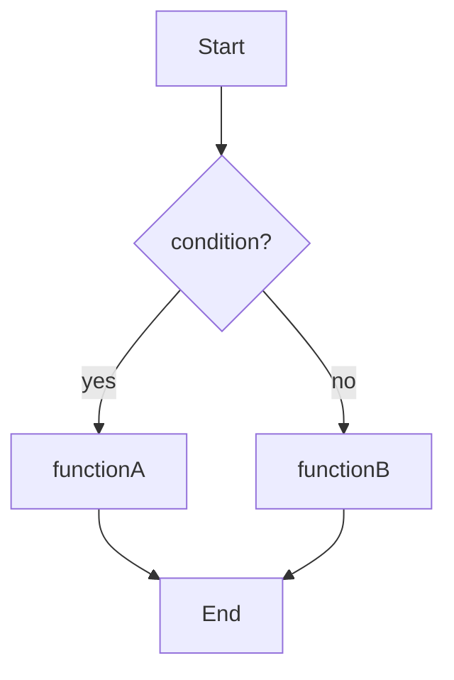

# SPEC: Funciones de Inteligencia Artificial — NETvault

**Versión:** 1.0  
**Fecha:** 2026-06-04  
**Autor:** Mavis (MiniMax Agent Team)  
**Proyecto:** NETvault — File Manager with AI Capabilities  
**Alcance:** 8 funciones core con IA integradas en el gestor de archivos

---

## Índice

1. [Indexar](#1-indexar)
2. [Terminal](#2-terminal)
3. [AI Assistant](#3-ai-assistant)
4. [Scaffolder](#4-scaffolder)
5. [Grafo](#5-grafo)
6. [Flujograma](#6-flujograma)
7. [Analizador](#7-analizador)
8. [Exportar](#8-exportar)

---

## 1. Indexar

### Descripción General

Sistema de indexación en memoria con búsqueda difusa para localizar archivos instantáneamente.

### Archivos Involucrados

| Archivo | Rol |
|---------|-----|
| `src/services/indexer/fileIndexer.ts` | Índice en memoria + Fuse.js |
| `src/services/searchService.ts` | Búsqueda unificada + fallback al proceso principal |

### Arquitectura

```
┌─────────────────────────────────────────────────────────────┐
│                     searchService.ts                        │
│  ┌─────────────┐    ┌─────────────┐    ┌────────────────┐ │
│  │  Fuzzy Match │ → │ IPC to Main │ → │  File Scanner  │ │
│  │ (Fuse.js)    │    │ (electron)  │    │ (Node fs)      │ │
│  └─────────────┘    └─────────────┘    └────────────────┘ │
└─────────────────────────────────────────────────────────────┘
```

### API Pública

```typescript
// src/services/indexer/fileIndexer.ts
class FileIndexer {
  constructor(rootPath: string)
  async buildIndex(): Promise<void>           // Escanea recursively
  search(query: string, options?: SearchOptions): SearchResult[]
  updateIndex(filePath: string, event: 'add' | 'change' | 'unlink'): void
  clearIndex(): void
}
```

### Comportamiento Detallado

| Aspecto | Detalle |
|---------|---------|
| **Motor de búsqueda** | Fuse.js con threshold 0.4 (búsqueda difusa tolerante) |
| **Campos indexados** | `name`, `path`, `extension` |
| **Peso de campos** | `name: 2`, `extension: 1` |
| **Persistencia** | En memoria RAM (se reconstruye en cada sesión) |
| **Fallback** | Si Fuse.js no encuentra resultados, consulta al proceso principal via IPC |
| **Limpiado** | `clearIndex()` elimina todo el índice |

### Tipos TypeScript

```typescript
interface SearchResult {
  item: IndexedFile;      // Archivo coincidente
  score: number;          // 0-1, mayor = más relevante
  matches?: Match[];      // Detalle de qué coincidió
}

interface IndexedFile {
  name: string;           // Nombre del archivo
  path: string;           // Ruta absoluta
  extension: string;      // Extensión (sin punto)
  size: number;           // Bytes
  modifiedAt: Date;       // Fecha de modificación
}

interface SearchOptions {
  limit?: number;         // Máx resultados (default: 50)
  extensions?: string[];  // Filtrar por extensión
  threshold?: number;     // 0-1, menor = más estricto
}
```

### Flujo de Datos

```
1. UserInput → searchService.search(query)
2. fileIndexer.fuzzySearch() → Fuse.js.match()
3. Si resultados < threshold → IPC.searchDirectory()
4. Return SearchResult[]
```

### Limitaciones Conocidas

- **Bug B1**: No registra archivos de subcarpetas automáticamente
- El índice se reconstruye completamente al iniciar sesión

---

## 2. Terminal

### Descripción General

Emulador de terminal integrado para ejecutar comandos PowerShell/CMD con paleta de comandos rápidos.

### Archivo Involucrado

| Archivo | Rol |
|---------|-----|
| `src/components/terminal/Terminal.tsx` | Componente React con xterm.js |

### Dependencias

- `xterm` + `xterm-addon-fit`: Emulación de terminal
- Electron IPC: Comunicación con proceso principal para ejecución real

### API Pública

```typescript
// src/components/terminal/Terminal.tsx (props)
interface TerminalProps {
  onData?: (data: string) => void;    // Callback para input del usuario
  onExit?: (exitCode: number) => void; // Callback al terminar
}
```

### Características

| Característica | Detalle |
|----------------|---------|
| **Shell soportadas** | PowerShell, CMD |
| **Comandos rápidos** | Paleta con shortcuts (cls, dir, ls, etc.) |
| **Auto-scroll** | Scroll automático al final de la salida |
| **Historial** | Historial de comandos accesible |
| **IP TTY** | Pseudo-terminal para comandos interactivos |

### Flujo de Ejecución

```
1. UserInput en Terminal → onData(data)
2. data → IPC.send('terminal:execute', { command: data })
3. MainProcess → child_process.spawn() → stdout/stderr stream
4. MainProcess → IPC.send('terminal:output', { data, type })
5. Terminal.tsx → xterm.write(data)
```

### Comandos Rápidos Implementados

| Comando | Alias | Descripción |
|---------|-------|-------------|
| `cls` | `clear` | Limpia la terminal |
| `dir` | `ls` | Lista archivos |
| `pwd` | `cd` | Muestra directorio actual |
| `exit` | `quit` | Cierra la terminal |

---

## 3. AI Assistant

### Descripción General

Asistente conversacional con IA para análisis de código, preguntas técnicas y soporte en contexto.

### Archivos Involucrados

| Archivo | Rol |
|---------|-----|
| `src/components/ai/AIChat.tsx` | Interfaz de chat |
| `src/services/indexer/aiService.ts` | Orquestador IA (Ollama + Claude) |

### Arquitectura

```
┌─────────────────────────────────────────────────────────────┐
│                       AIChat.tsx                            │
│  ┌─────────────┐    ┌─────────────┐    ┌────────────────┐ │
│  │ Chat UI     │ ← │ MessageList │ ← │ InputBox       │ │
│  │ (Messages)  │    │             │    │                │ │
│  └─────────────┘    └─────────────┘    └────────────────┘ │
└─────────────────────────────────────────────────────────────┘
                              ↓
┌─────────────────────────────────────────────────────────────┐
│                       aiService.ts                          │
│  ┌─────────────┐    ┌─────────────┐    ┌────────────────┐ │
│  │ ModelRouter │ → │ OllamaClient │ or │ ClaudeClient   │ │
│  │ (selector)  │    │ (localhost) │    │ (API key)      │ │
│  └─────────────┘    └─────────────┘    └────────────────┘ │
└─────────────────────────────────────────────────────────────┘
```

### API Pública

```typescript
// src/services/indexer/aiService.ts
class AIService {
  private provider: 'ollama' | 'claude';

  async chat(messages: ChatMessage[], options?: AIOptions): Promise<string>
  async complete(prompt: string, options?: AIOptions): Promise<string>
  setProvider(provider: 'ollama' | 'claude'): void
  isAvailable(): Promise<boolean>
}
```

### Tipos TypeScript

```typescript
interface ChatMessage {
  role: 'user' | 'assistant' | 'system';
  content: string;
  timestamp?: Date;
}

interface AIOptions {
  model?: string;                    // Modelo específico (ej: 'llama3', 'claude-3-opus')
  temperature?: number;              // 0-2 (default: 0.7)
  maxTokens?: number;                // Límite de tokens en respuesta
  systemPrompt?: string;             // Prompt de sistema override
  stream?: boolean;                  // Streaming response (default: false)
}

interface AIResponse {
  content: string;
  model: string;
  usage?: {
    inputTokens: number;
    outputTokens: number;
  };
  finishReason?: 'stop' | 'length' | 'error';
}
```

### Proveedores IA

| Proveedor | Endpoint | Configuración |
|-----------|----------|---------------|
| **Ollama** | `http://localhost:11434` | Sin API key, ejecución local |
| **Claude** | API Anthropic | Requiere `VITE_CLAUDE_API_KEY` en `.env` |

### Modelo por Defecto

| Proveedor | Modelo | Uso |
|-----------|--------|-----|
| Ollama | `llama3` | General, código, conversación |
| Claude | `claude-3-haiku-20240307` | Fallback rápido |

### Context Window

- El chat mantiene historial de conversación completo
- Cada mensaje incluye timestamp
- System prompt configurable para personalizar comportamiento

---

## 4. Scaffolder

### Descripción General

Generador de proyectos estructurados a partir de plantillas predefinidas.

### Archivos Involucrados

| Archivo | Rol |
|---------|-----|
| `src/components/ai/Scaffolder.tsx` | Interfaz de generación |
| `src/data/templates.ts` | Definición de plantillas |

### Plantillas Disponibles

```typescript
// src/data/templates.ts
export const PROJECT_TEMPLATES = {
  fastapi: { name: 'FastAPI', extensions: ['py'] },
  nextjs: { name: 'Next.js', extensions: ['ts', 'tsx'] },
  react: { name: 'React', extensions: ['jsx', 'tsx'] },
  electron: { name: 'Electron', extensions: ['ts', 'tsx', 'js'] },
  node: { name: 'Node.js', extensions: ['js', 'ts'] },
  python: { name: 'Python', extensions: ['py'] },
  flutter: { name: 'Flutter', extensions: ['dart'] },
  go: { name: 'Go', extensions: ['go'] },
  rust: { name: 'Rust', extensions: ['rs'] },
}
```

### API Pública

```typescript
// src/components/ai/Scaffolder.tsx (props)
interface ScaffolderProps {
  onProjectGenerated?: (path: string, template: string) => void;
}
```

### Flujo de Generación

```
1. UserSelectsTemplate → templateSelection
2. UserEntersProjectName → projectName
3. UserClicksGenerate → generateProject()
4. CreateDirectoryStructure(projectName)
5. GenerateFilesFromTemplate(template, projectName)
6. ShowPreview(files)
7. UserConfirms → WriteFilesToDisk()
8. onProjectGenerated(path, template)
```

### Estructura de Proyecto Generado

Cada plantilla define su propia estructura. Ejemplo FastAPI:

```
my-fastapi-project/
├── main.py
├── requirements.txt
├── app/
│   ├── __init__.py
│   ├── routers/
│   │   └── __init__.py
│   ├── models/
│   │   └── __init__.py
│   └── schemas/
│       └── __init__.py
└── tests/
    └── __init__.py
```

### Variables de Plantilla

| Variable | Descripción | Ejemplo |
|----------|-------------|---------|
| `{{PROJECT_NAME}}` | Nombre del proyecto | `my-fastapi-project` |
| `{{YEAR}}` | Año actual | `2026` |
| `{{DATE}}` | Fecha ISO | `2026-06-04` |

---

## 5. Grafo

### Descripción General

Visualización de grafo de conocimiento que muestra relaciones entre archivos y entidades.

### Archivo Involucrado

| Archivo | Rol |
|---------|-----|
| `src/components/graph/GraphPanel.tsx` | Panel de grafo con D3.js |

### Dependencias

- `d3`: Librería de visualización
- `dagre`: Layout de grafos dirigido

### API Pública

```typescript
// src/components/graph/GraphPanel.tsx (props)
interface GraphPanelProps {
  nodes: GraphNode[];
  edges: GraphEdge[];
  onNodeClick?: (node: GraphNode) => void;
  onEdgeClick?: (edge: GraphEdge) => void;
  layout?: 'dagre' | 'force' | 'tree';
  zoomable?: boolean;
  pannable?: boolean;
}
```

### Tipos TypeScript

```typescript
interface GraphNode {
  id: string;              // Identificador único
  label: string;           // Texto a mostrar
  type: 'file' | 'folder' | 'concept' | 'entity';  // Tipo de nodo
  metadata?: Record<string, any>;  // Datos adicionales
  x?: number;             // Posición X (calculada)
  y?: number;             // Posición Y (calculada)
}

interface GraphEdge {
  id: string;
  source: string;         // ID del nodo origen
  target: string;         // ID del nodo destino
  label?: string;         // Etiqueta de la relación
  type: 'import' | 'reference' | 'contains' | 'calls';
}
```

### Tipos de Relaciones

| Tipo | Color | Descripción |
|------|-------|-------------|
| `import` | Verde | Import/require entre archivos |
| `reference` | Azul | Referencia o mención |
| `contains` | Gris | Relación padre-hijo (carpeta) |
| `calls` | Amarillo | Llamada de función/método |

### Vistas de Grafo

| Vista | Descripción | Layout |
|-------|-------------|--------|
| **Conceptos** | Entidades y conceptos detectados por IA | Dagre (top-down) |
| **Importaciones** | Dependencias entre archivos | Dagre (left-right) |
| **Exploración** | Red libre de relaciones | Force-directed |

### Interacciones

| Acción | Resultado |
|--------|----------|
| Click en nodo | Resalta nodos conectados |
| Doble-click | Zoom al nodo |
| Drag nodo | Mueve nodo y actualiza posiciones |
| Scroll | Zoom in/out |
| Drag fondo | Pan del canvas |

---

## 6. Flujograma

### Descripción General

Generador de diagramas de flujo a partir de código fuente usando Mermaid.

### Archivo Involucrado

| Archivo | Rol |
|---------|-----|
| `src/components/flowchart/FlowchartPanel.tsx` | Panel de generación de diagramas |

### Dependencias

- `mermaid`: Renderizado de diagramas
- Parser de código: Extracción de funciones y flujos

### API Pública

```typescript
// src/components/flowchart/FlowchartPanel.tsx (props)
interface FlowchartPanelProps {
  code?: string;              // Código fuente input
  language?: string;          // 'javascript' | 'python' | 'typescript'
  onDiagramGenerated?: (mermaidCode: string, svg: string) => void;
}
```

### Proceso de Generación

```
┌─────────────────────────────────────────────────────────────┐
│  FlowchartGenerator.process(code, language)                │
│                                                             │
│  1. ParseCode(code, language)                               │
│     ↓                                                       │
│  2. ExtractFunctions() → FunctionNode[]                      │
│     ↓                                                       │
│  3. AnalyzeControlFlow() → ControlFlowEdge[]                │
│     ↓                                                       │
│  4. BuildMermaidGraph(nodes, edges) → mermaidCode           │
│     ↓                                                       │
│  5. Mermaid.render(mermaidCode) → svg                       │
└─────────────────────────────────────────────────────────────┘
```

### Elementos del Diagrama

| Estructura de Código | Nodo Mermaid | Descripción |
|---------------------|---------------|-------------|
| `function foo()` | `foo()` | Función/procedimiento |
| `if (cond)` | `if (cond?)` | Decisión (diamante) |
| `else` | `else` | Rama alternativa |
| `for/while` | `loop` | Ciclo |
| `return` | `return` | Fin de función |
| `throw` | `[exception]` | Manejo de errores |

### Sintaxis Mermaid Generada



### Formatos de Salida

| Formato | Extensión | Descripción |
|---------|-----------|-------------|
| SVG | `.svg` | Vector para web/docs |
| PNG | `.png` | Imagen rasterizada |
| Mermaid | `.mmd` | Código fuente del diagrama |

---

## 7. Analizador

### Descripción General

Análisis inteligente de documentos con extracción de entidades y relaciones mediante IA.

### Archivo Involucrado

| Archivo | Rol |
|---------|-----|
| `src/components/analyzer/AnalyzerPanel.tsx` | Panel de análisis de documentos |

### API Pública

```typescript
// src/components/analyzer/AnalyzerPanel.tsx (props)
interface AnalyzerPanelProps {
  file?: FileNode;                   // Archivo a analizar
  onAnalysisComplete?: (result: AnalysisResult) => void;
  extractionMode?: 'entities' | 'concepts' | 'full';
}
```

### Tipos TypeScript

```typescript
interface AnalysisResult {
  entities: ExtractedEntity[];        // Entidades detectadas
  concepts: string[];                // Conceptos clave
  summary: string;                   // Resumen del documento
  sentiment?: SentimentScore;        // Análisis de sentimiento
  metadata: DocumentMetadata;
}

interface ExtractedEntity {
  text: string;                      // Texto de la entidad
  type: 'person' | 'organization' | 'location' | 'date' | 'concept';
  confidence: number;                // 0-1
  position: { start: number; end: number };  // Índices en el texto
}

interface DocumentMetadata {
  language: string;
  wordCount: number;
  readingTime: number;               // Minutos estimados
  keyPhrases: string[];
}
```

### Flujo de Análisis

```
1. UserSelectsFile → fileNode
2. ReadFileContent(fileNode.path)
3. ChunkDocument(content) → chunks[] (para documentos grandes)
4. ForEach chunk → AI.analyze(chunk, extractionMode)
5. MergeResults(chunks) → AnalysisResult
6. DisplayResults(entities, concepts, summary)
```

### Modos de Extracción

| Modo | Descripción | Uso de IA |
|------|-------------|-----------|
| `entities` | Solo personas, lugares, organizaciones | Mínimo |
| `concepts` | Conceptos y temas clave | Medio |
| `full` | Todo + resumen + sentimiento | Completo |

### Integración con IA

- Usa `aiService.ts` para llamadas al modelo
- Soporta streaming para resultados parciales
- Fallback a procesamiento local si IA no disponible

---

## 8. Exportar

### Descripción General

Sistema de exportación flexible con múltiples formatos y compresión.

### Archivo Involucrado

| Archivo | Rol |
|---------|-----|
| `src/components/export/ExportPanel.tsx` | Panel de exportación |

### API Pública

```typescript
// src/components/export/ExportPanel.tsx (props)
interface ExportPanelProps {
  files: FileNode[];                 // Archivos a exportar
  onExportComplete?: (exportPath: string) => void;
  defaultFormat?: ExportFormat;
}

type ExportFormat = 'zip' | 'tar' | 'json' | 'markdown' | 'svg' | 'csv';
```

### Formatos Soportados

| Formato | Extensión | Compresión | Descripción |
|---------|-----------|------------|-------------|
| ZIP | `.zip` | Sí | Comprimido, multiplataforma |
| TAR | `.tar` | Opcional | Unix, sin compresión |
| JSON | `.json` | No | Metadatos y estructura |
| Markdown | `.md` | No | Documentación legible |
| SVG | `.svg` | No | Gráficos vectoriales |
| CSV | `.csv` | No | Datos tabulares |

### Flujo de Exportación

```
┌─────────────────────────────────────────────────────────────┐
│  ExportPanel.export(files, format)                          │
│                                                             │
│  1. ValidateFiles(files)                                   │
│     ↓                                                       │
│  2. GenerateExportData(files, format) → rawData            │
│     ↓                                                       │
│  3. ApplyCompression(rawData, format) → compressedData     │
│     ↓                                                       │
│  4. ShowSaveDialog() → userSelectedPath                    │
│     ↓                                                       │
│  5. WriteFile(userSelectedPath, compressedData)             │
│     ↓                                                       │
│  6. onExportComplete(path)                                 │
└─────────────────────────────────────────────────────────────┘
```

### Generadores por Formato

```typescript
const formatGenerators: Record<ExportFormat, DataGenerator> = {
  zip: generateZipArchive,
  tar: generateTarArchive,
  json: generateJsonStructure,
  markdown: generateMarkdownDoc,
  svg: generateSvgDiagram,
  csv: generateCsvData,
}
```

### Opciones de Exportación

| Opción | Tipo | Default | Descripción |
|--------|------|---------|-------------|
| `includeMetadata` | boolean | `true` | Incluye metadatos en exportación |
| `preserveStructure` | boolean | `true` | Mantiene estructura de carpetas |
| `compressionLevel` | 0-9 | `6` | Nivel de compresión ZIP |
| `flattenOutput` | boolean | `false` | Aplanar estructura de carpetas |

---

## Resumen de Dependencias Entre Funciones

```
┌─────────────────────────────────────────────────────────────┐
│                     aiService.ts                             │
│  (Orquestador IA: Ollama + Claude)                          │
│         ↓              ↓              ↓                     │
│   ┌──────────┐  ┌──────────┐  ┌──────────┐               │
│   │AI Assistant│ │ Scaffolder │  │  Analizador│              │
│   └──────────┘  └──────────┘  └──────────┘               │
│                                                             │
│                     fileIndexer.ts                          │
│  (Índice en memoria + búsqueda)                            │
│         ↓              ↓                                    │
│   ┌──────────┐  ┌──────────┐                              │
│   │   Grafo   │  │ Exportar  │                              │
│   └──────────┘  └──────────┘                              │
│                                                             │
│                     Terminal.tsx                            │
│  (Ejecución de comandos shell)                              │
└─────────────────────────────────────────────────────────────┘
```

---

## Notas de Implementación

### Consideraciones de Seguridad

1. **Claude API Key**: Almacenada en `localStorage` — considerar migrate a `electron-store` cifrado
2. **Ollama**: Ejecuta en proceso principal de Electron, bypassing CORS correctamente
3. **Terminal**: Comandos ejecutados con privilegios del usuario — sin sandboxing adicional

### Bugs Conocidos

| ID | Descripción | Impacto | Prioridad |
|----|-------------|---------|-----------|
| B1 | Indexer no registra archivos de subcarpetas | Búsqueda incompleta | Alta |
| B3 | Crear archivo/carpeta no funciona | Funcionalidad rota | Alta |
| B4 | Copiar/pegar carpetas falla | Solo archivos, no carpetas | Media |

### Roadmap de Funciones IA

- [ ] Historial persistente de chat para AI Assistant
- [ ] Indexación incremental (en lugar de rebuild completo)
- [ ] Exportación de grafos a formatos estándar (DOT, GraphML)
- [ ] Templates de Scaffolder personalizables por usuario
- [ ] Análisis semántico de código (no solo palabras)

---

*Documento generado automáticamente por Mavis — 2026-06-04*
