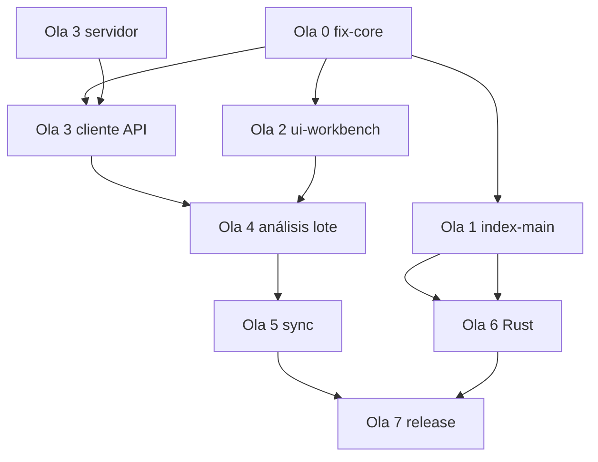

# Plan de remodelación y ejecución — NetVault

> **Documento maestro** para orquestador (agente principal) y subagentes.  
> Fuentes: `NETVAULT_BRIEF.md`, `HISTORY.md`, `plans/PLAN_APP_NETVAULT.md`, `plans/PLAN_SERVIDOR_NETVAULT.md`, `plans/INVESTIGACION_UI_NETVAULT.md`, auditoría 2026-06-04.

**Última actualización:** 2026-06-04  
**Estado:** listo para arrancar — **no implementar** hasta que el usuario confirme el archivo adicional pendiente.

---

## 1. Norte del producto (no negociable)

| Decisión | Fuente |
|----------|--------|
| Cliente = Electron + React + TS; archivos locales; sin secretos | `NETVAULT_BRIEF.md` §0 |
| Cerebro IA = **Claude solo vía servidor** (proxy + JWT en main) | Brief §1, `PLAN_SERVIDOR` |
| Salida de análisis = **formato único** por procedimiento + gate `aprobador_maximo` | Brief §4–5 |
| UI = layout **workbench** (actividad + sidebars + pestañas + terminal + status) | `INVESTIGACION_UI` |
| Índice local rápido → Fase 9 Rust **después** de arreglar indexador Node en main | `HISTORY.md`, auditoría |

**HISTORY.md describe el pasado (Ollama local, Fuse.js, fases 1–8).** El plan futuro **no elimina Ollama de golpe**, pero lo degrada a “modo dev/offline” cuando exista el proxy servidor.

---

## 2. Brecha: documentación vs código real

### 2.1 Lo que HISTORY.md afirma vs repo hoy

| HISTORY dice | Realidad verificada |
|--------------|---------------------|
| Fuse.js integrado (Fase 5) | Dependencia en `package.json`; **no importada** en `src/` |
| Indexador recursivo 5 niveles (Fase 6) | `recurseIndex` **no indexa archivos** en subcarpetas |
| FastIndexer + Levenshtein | Sí en memoria; búsqueda O(n); sin persistencia |
| Ollama vía IPC | Sí en `electron/main.ts` |
| `FileList` en estructura | Eliminado en `git pull`; `FilePanel` lista directo |
| `OLLAMA_INSTRUCTIONS.md` | Eliminado del repo |

### 2.2 Bugs P0 (bloquean “gestor usable”)

1. **`fileIndexer.recurseIndex`** — solo recorre directorios; archivos en profundidad ausentes del índice.
2. **`SearchBar.handleReindex`** — solo `clear()`; no reindexa ruta actual.
3. **`FilePanel` crear archivo/carpeta** — `onConfirm` ignora el valor de `InputDialog`; `createName` siempre vacío.
4. **`fs:copy` / pegar** — `copyFile` no copia árboles de carpetas.
5. **`fs:delete` permanente** — `unlink` no borra directorios.
6. **Quick access** — rutas hardcodeadas `C:\Users\User\...` en `App.tsx`.

### 2.3 Deuda P1 (feature engañosa o brief)

- `searchWithAI` sin uso en UI; sin búsqueda full-text (brief §3).
- `sql.js` / `fuse.js` sin uso; `CLAUDE.md` del repo sobrepromete.
- Toolbar Scaffolder con `onClick: () => {}`.
- `AIContext` no alimenta chat ni pipeline de análisis.
- Paneles Analyzer / Export / Graph = prototipos desconectados del formato único.
- `electron-builder.yml` → `LICENSE.txt` **no existe**.
- `README.md` sigue en Python/tkinter.
- JWT en brief vs `localStorage` para AI config hoy.

---

## 3. Arquitectura objetivo (cliente)

```
┌──────────────────────── MAIN (Node) ────────────────────────┐
│ fs (copy tree, delete tree, readdir+stats)                   │
│ indexer (scan, SQLite/JSON persist, optional Rust child)    │
│ apiClient (JWT memoria, /analysis, /sync, /approval)        │
└────────────────────────▲────────────────────────────────────┘
                         │ IPC tipado (preload)
┌────────────────────────┴────────────────────────────────────┐
│ RENDERER — Workbench UI                                      │
│ ActivityBar │ Explorer (áreas) │ Tabs (doc/mmd) │ Analysis  │
│ Terminal + Command Palette (⌘K) │ Status (sync, cost)       │
└─────────────────────────────────────────────────────────────┘
```

Reglas (`PLAN_APP_NETVAULT.md`): `contextIsolation`, sin `fs` en renderer, JWT solo en main.

---

## 4. Streams de trabajo y subagentes

| Stream | ID | Objetivo | Subagente sugerido | Repo / carpeta |
|--------|-----|----------|-------------------|----------------|
| **A** | `fix-core` | Gestor de archivos fiable (P0+P1 fs) | `typescript-reviewer` + implementación directa | `electron/`, `src/components/file-panel/`, `src/services/` |
| **B** | `index-main` | Indexador en main + persistencia + Fuse o prefix trie | `generalPurpose` / `performance-optimizer` | `electron/main.ts`, `src/services/indexer/` |
| **C** | `ui-workbench` | Remodelación layout según investigación UI | `frontend-patterns` + `frontend-design` skill | `src/App.tsx`, `src/components/layout/` |
| **D** | `server-mvp` | Auth + proxy Claude + `/analysis/run` stub | `nestjs-patterns` o `backend-patterns` | **nuevo** `server/` (fuera o dentro del monorepo) |
| **E** | `analysis-client` | Cliente análisis: disparar job, mostrar paquete, carpetas T&C | `generalPurpose` | `src/services/api/`, `src/components/analysis/` |
| **F** | `rust-9` | Binary `fast-indexer` + fallback | `rust-patterns` (cuando A+B estén verdes) | `fast-indexer/` (nuevo) |
| **G** | `docs-qa` | HISTORY, README, LICENSE, scripts rotos | `doc-updater` | raíz, `plans/`, `scripts/` |

**Orquestador (tú):** mantener este doc, ordenar merges, no mezclar D con A en el mismo PR si evitable.

---

## 5. Fases de ejecución (orden recomendado)

### Ola 0 — Estabilización (1 PR, bloqueante) — Stream **A** + **G** (parcial)

**Objetivo:** que `npm run electron:dev` sea usable para navegar, crear, copiar/pegar y buscar en subcarpetas.

| # | Tarea | Archivos | Criterio de aceptación |
|---|--------|----------|------------------------|
| 0.1 | Arreglar `recurseIndex` (archivos + dirs + stats vía IPC) | `fileIndexer.ts` o mover lógica a main | Indexar `src/` encuentra todos los `.ts` en subcarpetas |
| 0.2 | `handleReindex` + unificar con toolbar Indexar | `SearchBar.tsx`, pasar `currentPath` prop | ↻ reindexa carpeta activa; contador 📇 actualiza |
| 0.3 | Fix crear archivo/carpeta | `FilePanel.tsx` | Crear `test.txt` y carpeta `foo` funciona |
| 0.4 | `fs:copy`/`move` recursivo; delete dir | `electron/main.ts` | Copiar carpeta pequeña; eliminar carpeta vacía |
| 0.5 | Quick access con `app.getPath` | `electron` IPC + `App.tsx` | Descargas/Documents del usuario real |
| 0.6 | `LICENSE.txt` o quitar de `electron-builder.yml` | yaml / LICENSE | `npm run dist` no falla por license |
| 0.7 | Fix `scripts/build-info.js` path | `scripts/build-info.js` | `npm run dist:info` OK |

**Subagente `fix-core` — brief:**

```
Contexto: NetVault Electron. Bugs en fileIndexer recurseIndex, SearchBar reindex, FilePanel create dialog, fs copy/delete trees.
Haz solo Ola 0. No toques UI workbench ni servidor. npm run build debe pasar.
Entrega: lista de archivos tocados + cómo probar manualmente cada criterio 0.1–0.5.
```

---

### Ola 1 — Indexador en main (1–2 PR) — Stream **B**

**Objetivo:** quitar IPC por carpeta desde renderer; baseline para Rust.

| # | Tarea | Criterio |
|---|--------|----------|
| 1.1 | IPC `index:scan`, `index:search`, `index:stats` en main | Renderer no llama `readDirectory` en bucle para indexar |
| 1.2 | Persistencia SQLite (`better-sqlite3` o `sql.js` en main) o JSON en `%APPDATA%/NetVault/` | Reabrir app conserva índice de última raíz |
| 1.3 | Integrar **Fuse.js** en búsqueda o documentar por qué prefix+trie | HISTORY alineado con código |
| 1.4 | `autoIndex` al cambiar `currentPath` (debounced) | Navegar dispara index en background |
| 1.5 | Script `scripts/bench-index.mjs` | Reporte files/s en ruta de prueba |

**Subagente `index-main` — brief:**

```
Mueve indexación a electron/main. Mantén API searchService compatible. Añade bench script.
No implementes Rust aún. Fallback si scan falla: error visible en UI.
```

---

### Ola 2 — Shell workbench (2 PR) — Stream **C**

**Objetivo:** UI alineada con `INVESTIGACION_UI` sin perder dual panel donde aporte.

| # | Tarea | Referencia UI |
|---|--------|----------------|
| 2.1 | Activity bar (Explorador, Búsqueda, Análisis, Grafo, Sync) | §2 layout |
| 2.2 | Sidebar: árbol T&C / P&C / Transportes (configurable root) | Brief §5 |
| 2.3 | Área central: pestañas DocumentViewer + Flowchart | §2 |
| 2.4 | Sidebar secundaria: panel resultado análisis (placeholder) | §2 |
| 2.5 | Status bar: sync + versión + placeholder costo | §2 |
| 2.6 | Paleta ⌘K (`cmdk`) — comandos: analizar, indexar, ir a área | §1.4, §3 |

**Subagente `ui-workbench` — brief:**

```
Remodela App.tsx hacia workbench. Conserva operaciones de archivo de Ola 0.
frontend-design + web-design-guidelines antes de commit UI.
No conectar servidor aún; placeholders OK con estados loading/empty/error.
```

**Paralelizable con Ola 1** si tocan carpetas distintas (`layout/` vs `electron/`).

---

### Ola 3 — Contrato servidor + cliente auth (paralelo) — Stream **D** + **E** (inicio)

**Objetivo:** dejar de llamar Anthropic desde el `.exe` en producción.

| # | Stream D (servidor) | Stream E (cliente) |
|---|---------------------|-------------------|
| 3.1 | Proyecto `server/` Express+TS+Zod, `/health` | `apiClient` en main, IPC `api:request` |
| 3.2 | `/auth/login` JWT (stub o SSO real) | Login UI mínima; JWT en memoria main |
| 3.3 | `/analysis/run` mock → paquete formato único | Tipos TS `AnalysisPackage`, escritura en carpeta procedimiento |
| 3.4 | Proxy Claude real + redacción | Sustituir `aiService` Claude directo por IPC |
| 3.5 | Ollama → flag `NETVAULT_DEV_LOCAL_AI=1` | Documentar en HISTORY |

**Subagente `server-mvp` — brief:**

```
Implementa PLAN_SERVIDOR_NETVAULT.md fases 1–2 mínimas: auth, proxy Claude, POST /analysis/run con salida JSON del brief §4.
Sin sync ni webhook aún. Docker-ready.
```

**Subagente `analysis-client` — brief:**

```
Carpeta por procedimiento según brief §5. Botón Analizar → main → POST /analysis/run → guardar archivos fijos.
Human-in-the-loop: estado borrador en _meta.json. No subir a intranet sin approval API.
```

---

### Ola 4 — Análisis productivo + lote — Stream **E**

| # | Tarea |
|---|--------|
| 4.1 | Wizard / lote: analizar subcarpeta (cola local → servidor) |
| 4.2 | Conectar `DocumentViewer` + `mammoth`/`pdfjs` como entrada al motor |
| 4.3 | Diff flujograma viejo vs nuevo (`FlowchartPanel`) |
| 4.4 | Deprecar o cablear `AnalyzerPanel` al paquete servidor (no Ollama suelto) |
| 4.5 | `AIContext` → selección manifest para jobs, no chat suelto |

---

### Ola 5 — Sync + aprobación — Streams **D** + **E**

Seguir `PLAN_SERVIDOR` fases 4–5 y `PLAN_APP` fase 5: `/sync/pull|push`, UI conflicto, `/approval/submit`, badge en explorer.

---

### Ola 6 — Rust Fase 9 — Stream **F**

**Precondición:** Ola 1 bench documentado.

| # | Tarea |
|---|--------|
| 6.1 | Crate `fast-indexer` (index, search, NDJSON stdout) |
| 6.2 | Empaquetar en `electron-builder` extraResources |
| 6.3 | `IndexerProvider`: `rust` \| `node` con fallback |
| 6.4 | Criterios: 100k archivos SSD — medir y comparar con bench Ola 1 |

---

### Ola 7 — Release — Stream **G**

- Code signing, README alineado a brief, HISTORY actualizado, `agent-browser` smoke E2E críticos.

---

## 6. Grafo de dependencias



**Paralelo seguro tras Ola 0:** `O1` + `O2` + `O3D` (tres subagentes).

---

## 7. Roles del orquestador vs subagentes

### Orquestador (agente principal en Cursor)

1. Leer `NETVAULT_BRIEF.md` + este plan antes de cada ola.
2. Abrir **un PR por ola** (o sub-PR por stream si el diff es grande).
3. Tras cada subagente: `npm run build` + checklist manual de la ola.
4. Actualizar `HISTORY.md` al cerrar Ola 0, 1, 3, 6 (no dejar mentiras sobre Fuse/Rust).
5. No mezclar remodel UI masiva con cambios en `electron/main` sin coordinar conflictos.

### Cuándo lanzar cada subagente

| Momento | Subagente | Input obligatorio |
|---------|-----------|-------------------|
| Inicio | `explore` (readonly) | “Validar que Ola 0 fixes no rompieron imports” |
| Post Ola 0 | `code-reviewer` | Diff `electron/` + `file-panel/` |
| Ola 2 | `typescript-reviewer` | Solo `src/components/layout/` |
| Pre PR UI | skill `web-design-guidelines` | Reporte `archivo:linea` |
| Ola 3 servidor | `security-reviewer` | JWT, sin secrets en cliente |
| Ola 6 | `rust-reviewer` | Crate `fast-indexer` |

---

## 8. Definition of Done global

Una ola se cierra solo si:

- [ ] `npm run build` sin errores
- [ ] Criterios de la ola probados en `npm run electron:dev`
- [ ] Sin secretos en cliente (API keys solo servidor, salvo flag dev)
- [ ] `HISTORY.md` o `plans/` actualizado si cambió comportamiento
- [ ] Brief §0 respetado (TS/Electron, no Python en cliente)

---

## 9. MVP cliente (priorización brief §8 pregunta 3)

**Primera versión usable (post Ola 0–2–3 mínima):**

1. Explorador por área + operaciones archivo OK  
2. Preview docx/pdf/md + Mermaid  
3. Búsqueda por nombre (índice main)  
4. Analizar un procedimiento → carpeta formato único (servidor mock o real)  
5. Login + JWT  

**Después:** sync, aprobación ✅, lote, Rust, grafo ZYMO, investigación web.

---

## 10. Archivos de referencia rápida

| Documento | Uso |
|-----------|-----|
| `NETVAULT_BRIEF.md` | Producto y formato único |
| `HISTORY.md` | Evolución 1–8; actualizar al migrar IA |
| `plans/PLAN_APP_NETVAULT.md` | Responsabilidades cliente |
| `plans/PLAN_SERVIDOR_NETVAULT.md` | API y fases servidor |
| `plans/INVESTIGACION_UI_NETVAULT.md` | Layout workbench |
| `MIGRATION_PLAN.md` § Fase 9 | Detalle Rust |
| Este archivo | Orden de ejecución y subagentes |

---

## 11. Próximo paso inmediato

1. Usuario entrega **archivo adicional** pendiente → orquestador lo anexa como §12 o `plans/ANEXO_*.md`.
2. Confirmar si servidor vive en **este repo** (`server/`) o repo aparte.
3. Lanzar subagente **`fix-core`** con brief Ola 0 (un solo PR).

---

*Generado para ejecución multi-agente. No reemplaza `PLAN_APP` ni `PLAN_SERVIDOR`; los operationaliza.*
